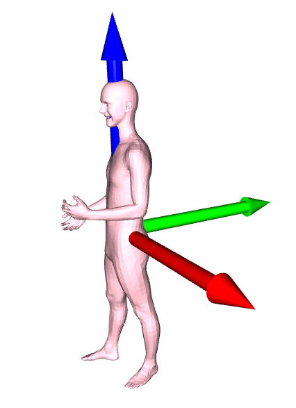

## Populating 3D Scenes by Learning Human-Scene Interaction

[[Project Page](https://posa.is.tue.mpg.de/)]
[[Paper](https://arxiv.org/pdf/2012.11581.pdf)]


## License

Software Copyright License for non-commercial scientific research purposes.
Please read carefully the following [terms and conditions](LICENSE) and any accompanying
documentation before you download and/or use the POSA data, model and
software, (the "Data & Software"), including 3D meshes, images, videos,
textures, software, scripts, and animations. By downloading and/or using the
Data & Software (including downloading, cloning, installing, and any other use
of the corresponding github repository), you acknowledge that you have read
these [terms and conditions](LICENSE), understand them, and agree to be bound by them. If
you do not agree with these [terms and conditions](LICENSE), you must not download and/or
use the Data & Software. Any infringement of the terms of this agreement will
automatically terminate your rights under this [License](LICENSE).

## Description

This repository contains the training, random sampling, and scene population code used for the experiments in [POSA](https://posa.is.tue.mpg.de/).

## Installation 

To install the necessary dependencies run the following command:
```shell
    pip install -r requirements.txt
```
The code has been tested with Python 3.7, CUDA 10.0, CuDNN 7.5 and PyTorch 1.7 on Ubuntu 20.04. 

## Dependencies
### POSA_dir
To be able to use the code you need to get the [POSA_dir.zip](https://posa.is.tue.mpg.de/). After unzipping, you should have a directory with the following structure:
```bash
POSA_dir
├── cam2world
├── data
├── mesh_ds
├── scenes
├── sdf
└── trained_models
```
The content of each folder is explained below:
- `trained_models` contains two trained models. One is trained on the `contact` only and the other one is trained on `contact` and `semantics`.
- `data` contains the train and test data extracted from the [PROX Dataset](https://prox.is.tue.mpg.de/) and [PROX-E Dataset](https://github.com/yz-cnsdqz/PSI-release#datasets).
- `scenes` contains the 12 scenes from [PROX Dataset](https://prox.is.tue.mpg.de/)
- `sdf` contains the signed distance field for the scenes in the previous folder.
- `mesh_ds` contains mesh downsampling and upsampling related files similar to the ones in [COMA](https://coma.is.tue.mpg.de/).

### SMPL-X
You need to get the [SMPLx Body Model](https://smpl-x.is.tue.mpg.de/). Please extract the folder and rename it 
to `smplx_models` and place it in the `POSA_dir` above.

### AGORA
In addition, you need to get the `POSA_rp_poses.zip` file from [AGORA Dataset](https://agora.is.tue.mpg.de/) and extract in the `POSA_dir`. 
This file contrains a number of test poses to be used in the next steps. Note that you don't need the whole AGORA dataset.

Finally run the following command or add it to your `~/.bashrc`
```Shell
export POSA_dir=Path of Your POSA_dir
```
# Inference
You can test `POSA` using the trained models provided. Below we provide examples of how to generate POSA features and how to pupulate a 3D scene.
## Random Sampling
To generate random features from a trained model, run the following command
```Shell
python src/gen_rand_samples.py --config cfg_files/contact.yaml --checkpoint_path $POSA_dir/trained_models/contact.pt --pkl_file_path $POSA_dir/POSA_rp_poses/rp_aaron_posed_001_0_0.pkl --render 1 --viz 1 --num_rand_samples 3 
```
Or
```Shell
python src/gen_rand_samples.py --config cfg_files/contact_semantics.yaml --checkpoint_path $POSA_dir/trained_models/contact_semantics.pt --pkl_file_path $POSA_dir/POSA_rp_poses/rp_aaron_posed_001_0_0.pkl --render 1 --viz 1 --num_rand_samples 3 
```

This will open a window showing the generated features for the specified `pkl` file. It also render the features to the folder `random_samples` in `POSA_dir`.

The number of generated feature maps can be controlled by the flag `num_rand_samples`.

If you don't have a screen, you can turn off the visualization `--viz 0`.

If you don't have CUDA installed then you can add this flag `--use_cuda 0`. This applies to all commands in this repository.

You can also run the same command on the whole folder of test poses
```Shell
python src/gen_rand_samples.py --config cfg_files/contact_semantics.yaml --checkpoint_path $POSA_dir/trained_models/contact_semantics.pt --pkl_file_path $POSA_dir/POSA_rp_poses --render 1 --viz 1 --num_rand_samples 3 
```
## Scene Population
Given a body mesh from the [AGORA Dataset](https://agora.is.tue.mpg.de/), `POSA` automatically places the body mesh in 3D scene. 
```Shell
python src/affordance.py --config cfg_files/contact_semantics.yaml --checkpoint_path $POSA_dir/trained_models/contact_semantics.pt --pkl_file_path $POSA_dir/POSA_rp_poses/rp_aaron_posed_001_0_0.pkl --scene_name MPH16 --render 1 --viz 1 
```
This will open a window showing the placed body in the scene. It also render the placements to the folder `affordance` in `POSA_dir`.

You can control the number of placements for the same body mesh in a scene using the flag `num_rendered_samples`, default value is `1`. 

The generated feature maps can be shown by setting adding `--show_gen_sample 1`

You can also run the same script on the whole folder of test poses
```Shell
python src/affordance.py --config cfg_files/contact_semantics.yaml --checkpoint_path $POSA_dir/trained_models/contact_semantics.pt --pkl_file_path $POSA_dir/POSA_rp_poses --scene_name MPH16 --render 1 --viz 1 
```

To place clothed body meshes, you need to first buy the [Renderpeople](https://renderpeople.com/) assets, or get the [free models](https://renderpeople.com/free-3d-people/). 
Create a folder `rp_clothed_meshes` in `POSA_dir` and place all the clothed body `.obj` meshes in this folder. Then run this command:
```Shell
python src/affordance.py --config cfg_files/contact_semantics.yaml --checkpoint_path $POSA_dir/trained_models/contact_semantics.pt --pkl_file_path $POSA_dir/POSA_rp_poses/rp_aaron_posed_001_0_0.pkl --scene_name MPH16 --render 1 --viz 1 --use_clothed_mesh 1
```

# Testing on Your Own Poses
`POSA` has been tested on the `AGORA` dataset **only**. Nonetheless, you can try `POSA` with any `SMPL-X` poses you have. You just need a `.pkl` file
with the `SMPLX` body parameters and the gender. Your `SMPL-X` vertices **must** be brought to a canonical form similar to the POSA training data.
This means the vertices should be centered at the pelvis joint, the `x` axis pointing to the left, the `y` axis pointing backward, and the `z` axis pointing upwards.
As shown in the figure below. The x,y,z axes are denoted by the red, green, blue colors respectively.



See the function `pkl_to_canonical` in [data_utils.py](src/data_utils.py) for an example of how to do this transformation.

# Training
To retrain `POSA` from scratch run the following command
```Shell
python src/train_posa.py --config cfg_files/contact_semantics.yaml
```

# Visualize Ground Truth Data
You can also visualize the training data
```Shell
python src/show_gt.py --config cfg_files/contact_semantics.yaml --train_data 1
```
Or test data
```Shell
python src/show_gt.py --config cfg_files/contact_semantics.yaml --train_data 0
```
Note that the ground truth data has been downsampled to speed up training as explained in the paper. [See training details in appendices](https://arxiv.org/pdf/2012.11581.pdf). 

## Citation

If you find this Model & Software useful in your research we would kindly ask you to cite:

```
@inproceedings{Hassan:CVPR:2021,
    title = {Populating {3D} Scenes by Learning Human-Scene Interaction},
    author = {Hassan, Mohamed and Ghosh, Partha and Tesch, Joachim and Tzionas, Dimitrios and Black, Michael J.},
    booktitle = {Proceedings {IEEE/CVF} Conf.~on Computer Vision and Pattern Recognition ({CVPR})},
    month = jun,
    month_numeric = {6},
    year = {2021}
}
```
If you use the extracted training data, scenes or sdf the please cite:
```
@inproceedings{PROX:2019,
  title = {Resolving {3D} Human Pose Ambiguities with {3D} Scene Constraints},
  author = {Hassan, Mohamed and Choutas, Vasileios and Tzionas, Dimitrios and Black, Michael J.},
  booktitle = {International Conference on Computer Vision},
  month = oct,
  year = {2019},
  url = {https://prox.is.tue.mpg.de},
  month_numeric = {10}
}
@inproceedings{PSI:2019,
  title = {Generating 3D People in Scenes without People},
  author = {Zhang, Yan and Hassan, Mohamed and Neumann, Heiko and Black, Michael J. and Tang, Siyu},
  booktitle = {Computer Vision and Pattern Recognition (CVPR)},
  month = jun,
  year = {2020},
  url = {https://arxiv.org/abs/1912.02923},
  month_numeric = {6}
}
```
If you use the AGORA test poses, the please cite:
```
@inproceedings{Patel:CVPR:2021,
  title = {{AGORA}: Avatars in Geography Optimized for Regression Analysis},
  author = {Patel, Priyanka and Huang, Chun-Hao P. and Tesch, Joachim and Hoffmann, David T. and Tripathi, Shashank and Black, Michael J.},
  booktitle = {Proceedings IEEE/CVF Conf.~on Computer Vision and Pattern Recognition (CVPR)},
  month = jun,
  year = {2021},
  month_numeric = {6}
}
```

## Contact
For commercial licensing (and all related questions for business applications), please contact [ps-licensing@tue.mpg.de](mailto:ps-licensing@tue.mpg.de).